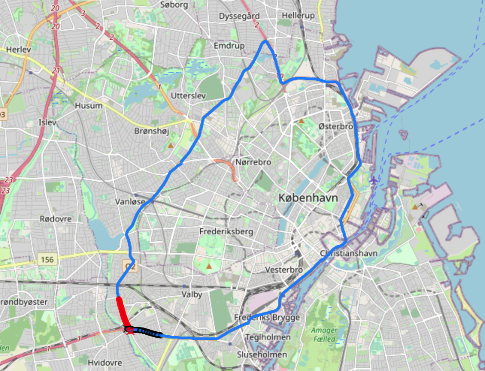

Author: Milena Bajic

# Package Description
A package which preprocesses standard data for analysis. 
The code performs map matching using the OSRM service, running a Hidden Markov Model in the background. 

As a result, the GPS coordinates are corrected to the Open Street Map road networks. 
The package in addition includes handy functions to plot 
uncorrected and corrected GPS trajectories on Open Street Map in the web browser.

# Run instructions
**Prerequisites:** To access the database, you need a VPN and database credentials. 

To run the code, run prepare_DRD.py script with additional options: 
* You must pass one vehicle type: either --p79, --viafrik or --aran.  
* You must pass either: 
    * 1) --route <route_name> where json/routes.json file contains information for the chosen route -> in this case, all trips from this route will be passed  
    * 2) --trip <trip_id>: the route name should not be passed, it will be loaded from json/routes.json is the trip is found there or it will be set to unkown if it is not found. 
* Additional options: 
    * 1) --map_match: run map matching using OSRM (default: False) 
    * 2) --plot: plot and save trip trajectory on Open Street Map if a web-browser is available, else only the trip geometry. (default: False) 
    * 3) --conn_file: json file with connection data (default: hidden json/.connection.json)
    * 4) --routes_file: json file with route information (default: json/routes.json) 
    * 5) --out_dir: set base output directory (default is data and will be created in the current directory is not already present) 
    * 6) --preload_map_matched: if passed with --map_match, the map matched output will be loaded but not recreated.  Primarily used for debugging. (default: False)  
    * 7) --preload_plots: load map matched OSM plots. Primarily used for debugging. (default: False)  
    * 8) --dev_mode: run the pipeline on selected lines of database entries. The number of lines can be changed by calling load_DRD_data(Primarily used for debugging. (default: False)  
    * 9) --dev_mode_n_lines: number of lines to load in --dev_mode (default=500)

# Run Examples
* Process and map match and plot p79 trips on CPH1_VH route: 
python -i prepare_DRD.py --p79 --route CPH1_VH --map_match --plot  
-> the output will be in: data/P79_processesed_data/CPH1_VH  
(out_dir='data' by default)
* Process and map match ARAN trip 9ab9ce62-e197-4672-9c85-c9b37b1c88cd:  
python -i prepare_DRD.py --aran --trip 9ab9ce62-e197-4672-9c85-c9b37b1c88cd --map_match --plot  
-> the output will be in: data/ARAN_processesed_data/CPH1_VH  
(out_dir='data' by default, the trip id is listed in json/routes.json under CPH1_VH so the route will be set to CPH1_VH, else for an unknown trip, the output will be in: data/ARAN_processesed_data/unknown)

# Output
* The output files and plots (if run with: --plot option) are stored in: <out_dir>/<vehicle_type>_processesed_data/<route_name> 

# Run with Docker
* Build a docker image: 
  docker build -t \<name\> . 

* Run a docker image:  
  Example: docker run -v $(pwd):/map_matching_standard_data_docker \<name\> python3 -u prepare_DRD.py --p79 --route CPH1_VH --map_match
